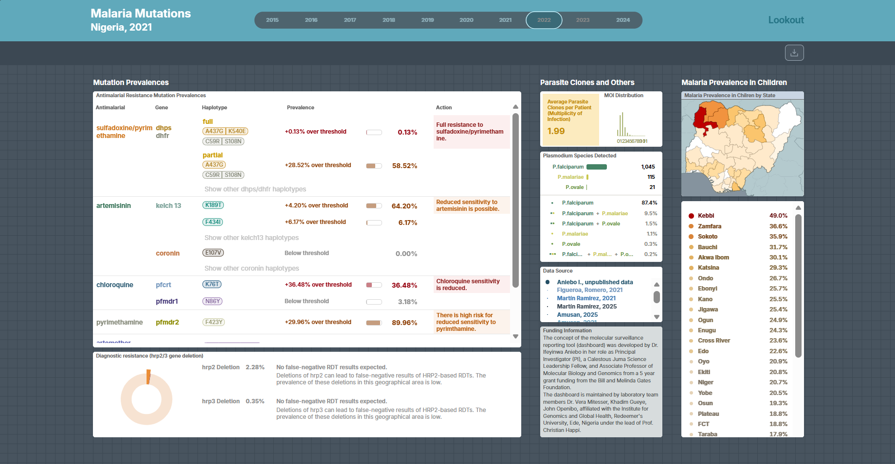

# Aniebo Genomics Lab

The Aniebo Genomics Lab, based at the Institute of Genomics and Global Health (IGH), focuses on malaria genomics, population genetics, and genomic surveillance across Africa.

## 🔬 Research Areas

* Malaria population genomics
* Antimalarial drug resistance
* Genomic surveillance
* Bioinformatics and data analysis

## 🌍 Research Focus

* *Plasmodium falciparum* population structure in Nigeria
* Drug resistance monitoring and evolution
* Amplicon sequencing and whole-genome analysis

## 🏛 Affiliation

Institute of Genomics and Global Health (IGH)

🌐 Website: https://ighresearch.org/en/

🔗 LinkedIn: https://www.linkedin.com/company/acegid-igh

## 📫 Contact

Dr. Ifeyinwa Aniebo

🔗 LinkedIn: https://www.linkedin.com/in/ifyaniebo/

### 🌐 ParaSight

 

🌐 Visit our website: <a href="https://para-sight.org/" target="_blank">https://para-sight.org/</a>

 

